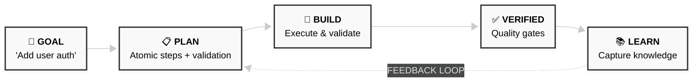

---

## Table of Contents

1. [Why STUDIO?](#why-studio)
2. [Quick Start](#quick-start)
3. [Core Concepts](#core-concepts)
4. [Commands](#commands)
5. [Knowledge System](#knowledge-system)
6. [Enterprise Features](#enterprise-features)
7. [Architecture](#architecture)
8. [Documentation](#documentation)

---

## Why STUDIO?

| AI Problem | STUDIO Solution |
|------------|-----------------|
| 🤔 **Assumes requirements** | Mandatory questioning with domain experts |
| 🏃 **Declares success early** | Quality gates block incomplete work |
| 🌊 **Drifts from intent** | Plan anchors every execution step |
| 🧠 **Forgets your preferences** | Knowledge base persists constraints across sessions |
| 🔄 **Repeats same mistakes** | Sprint evolution promotes patterns to rules |
| ❌ **Silent failures** | Classified errors with fix suggestions |
| 😰 **No recovery option** | Git-based rollback to any task |

---

## Quick Start

### Installation

```bash
/plugin marketplace add https://github.com/twofoldtech-dakota/studio.git
/plugin install studio@twofoldtech-dakota
```

### Your First Build

```bash
/build "Add user authentication with email verification"
```

STUDIO will:
1. **Ask clarifying questions** using domain expert personas
2. **Create an execution-ready plan** with atomic, validated steps
3. **Challenge the plan** for edge cases and risks
4. **Execute with validation** and automatic retry on failure
5. **Run quality gates** before marking complete
6. **Capture learnings** into the knowledge base

---

## Core Concepts

### The Three Agents

```
┌───────────────────────┬───────────────────────┬───────────────────────────────┐
│                       │                       │                               │
│   🔵 THE PLANNER      │   🟡 THE BUILDER      │   🟣 THE CONTENT WRITER       │
│                       │                       │                               │
│   Creates plans       │   Executes plans      │   Creates content             │
│   Embeds constraints  │   Validates steps     │   Applies brand voice         │
│   Challenges self     │   Captures learnings  │   Optimizes for SEO           │
│                       │                       │                               │
└───────────────────────┴───────────────────────┴───────────────────────────────┘
```

### The Five Challenges

Before any plan executes, it must answer:

1. **REQUIREMENTS** — Does this solve what was asked?
2. **EDGE CASES** — What inputs would break this?
3. **SIMPLICITY** — Is this the simplest solution?
4. **INTEGRATION** — Does this fit the codebase?
5. **FAILURE MODES** — What happens when it fails?

### Quality Gate Verdicts

| Verdict | Meaning |
|---------|---------|
| **STRONG** | All checks passed |
| **SOUND** | Required passed, optional warnings |
| **BLOCKED** | Required check failed — fix required |

---

## Commands

### Build Commands

| Command | Description |
|---------|-------------|
| `/build "goal"` | Start a new build |
| `/build:preview "goal"` | Preview what would happen (dry-run) |
| `/build:interactive "goal"` | Step-by-step with confirmation |
| `/build resume` | Resume incomplete build |
| `/build status` | Check current build |
| `/build abort` | Cancel build |

### Brand & Content

| Command | Description |
|---------|-------------|
| `/brand` | Start brand discovery (5-phase interview) |
| `/brand:update [area]` | Update identity, voice, audience, or messaging |
| `/brand:audit` | Check brand consistency |
| `/blog "topic"` | Create brand-aligned blog post |
| `/blog:outline "topic"` | Create outline only |
| `/blog:ideas` | Generate topic ideas |

### Project Management

| Command | Description |
|---------|-------------|
| `/project:init "name"` | Create multi-task project |
| `/project:task "goal"` | Add task with dependencies |
| `/project:status` | Show project status |
| `/project:graph` | Display dependency graph |

### Utilities

| Command | Description |
|---------|-------------|
| `/analytics` | View build metrics dashboard |
| `/trace` | Show requirements traceability |
| `/rollback:list` | List recovery points |
| `/rollback:to <task>` | Rollback to pre-task state |

---

## Knowledge System

STUDIO actively evolves its understanding through the **Dynamic SOP System**.

### Knowledge Base Structure

```
┌─────────────────────────────────────────────────────────────────────────────────┐
│                          STUDIO KNOWLEDGE BASE                                   │
├─────────────────────────────────────────────────────────────────────────────────┤
│                                                                                 │
│  ┌─────────────────────────────────────────────────────────────────────────┐   │
│  │  STRICT CONSTRAINTS                    (Never Violate)                  │   │
│  │  Rules that kill performance/quality — promoted after 2+ occurrences    │   │
│  │  Example: "Never mutate React state directly"                           │   │
│  └─────────────────────────────────────────────────────────────────────────┘   │
│                                                                                 │
│  ┌─────────────────────────────────────────────────────────────────────────┐   │
│  │  SLOP LEDGER                           (Avoid These Mistakes)           │   │
│  │  Naming, structural mistakes — captured on 1st occurrence + rework cost │   │
│  │  Example: "Mixed camelCase and kebab-case in component files"           │   │
│  └─────────────────────────────────────────────────────────────────────────┘   │
│                                                                                 │
│  ┌─────────────────────────────────────────────────────────────────────────┐   │
│  │  PERFORMANCE DELTA                     (Measured Improvements)          │   │
│  │  Before/after metrics — must have concrete numbers                      │   │
│  │  Example: "LCP: 2.4s → 1.1s (54% improvement) via lazy loading"         │   │
│  └─────────────────────────────────────────────────────────────────────────┘   │
│                                                                                 │
│  ┌─────────────────────────────────────────────────────────────────────────┐   │
│  │  PENDING QUEUE                         (Awaiting Promotion)             │   │
│  │  Signals with 1 occurrence — moves to Strict Constraints after 2nd      │   │
│  └─────────────────────────────────────────────────────────────────────────┘   │
│                                                                                 │
└─────────────────────────────────────────────────────────────────────────────────┘
```

### Sprint Evolution

Every **5 tasks**, STUDIO proposes knowledge base evolution:

```
Task 1 → Task 2 → Task 3 → Task 4 → Task 5 → 🔄 EVOLUTION
                                              │
                                              ├── Propose deletable rules (stale, no violations)
                                              ├── Propose new enforcement (recurring patterns)
                                              └── User approves → Knowledge base updated
```

### Learning System Scripts

| Script | Purpose |
|--------|---------|
| `./scripts/learnings.sh classify <text>` | Classify learning and determine destination |
| `./scripts/learnings.sh check-duplicate <title>` | Check for existing similar entries |
| `./scripts/learnings.sh extract-metrics <text>` | Extract before/after metrics |
| `./scripts/signal-audit.sh classify <text>` | Full signal classification as JSON |
| `./scripts/signal-audit.sh is-noise <text>` | Check if entry should be filtered |
| `./scripts/sprint-evolution.sh status` | Show sprint progress |
| `./scripts/sprint-evolution.sh propose` | Generate evolution proposals |
| `./scripts/sprint-evolution.sh reset` | Start new sprint after review |

---

## Enterprise Features

### SICVF Validation Protocol

For large-scale projects, every task must pass SICVF validation:

| Criterion | Description |
|-----------|-------------|
| **S**ingle-pass | Can be completed in one build cycle |
| **I**ndependent | No circular dependencies |
| **C**lear boundaries | Well-defined inputs and outputs |
| **V**erifiable | Has executable acceptance criteria |
| **F**its context | Within token budget for agent |

```bash
# Validate a task
./scripts/sicvf-validate.sh --task-id <task_id>
```

### 4-Tier Context System

Context is preserved across tasks in tiers:

| Tier | Budget | Contents |
|------|--------|----------|
| **Tier 0** | 5K tokens | Invariants (always loaded) |
| **Tier 1** | 30K tokens | Active task context |
| **Tier 2** | 15K tokens | Summarized recent context |
| **Tier 3** | 5K tokens | Indexed reference (on-demand) |

```bash
# Inject context for a task
./scripts/context-inject.sh --task-id <task_id> --goal "<goal>"
```

### Enterprise Decomposition

For projects with 10+ tasks, the Planner generates a **Decomposition Map**:

1. **Pillar Analysis** — Score 6 architectural pillars (data, auth, api, ui, integration, infra)
2. **Hierarchy** — Epic → Feature → Task decomposition
3. **Dependency Graph** — DAG with critical path and parallel batches
4. **Context Plan** — 4-tier context preservation strategy

See `studio/prompts/enterprise-decomposition.md` for the full protocol.

---

## Architecture

```
                                STUDIO SYSTEM v5.0
    ┌──────────────────────────────────────────────────────────────────────────┐
    │                                                                          │
    │   ┌──────────┐     ┌──────────┐     ┌──────────┐     ┌──────────────┐   │
    │   │   USER   │────▶│ PLANNER  │────▶│ BUILDER  │────▶│   VERIFIED   │   │
    │   │   GOAL   │     │  AGENT   │     │  AGENT   │     │    OUTPUT    │   │
    │   └──────────┘     └────┬─────┘     └────┬─────┘     └──────┬───────┘   │
    │                         │                │                   │           │
    │                    ┌────┴────────────────┴───────────────────┘           │
    │                    │                                                     │
    │              ┌─────┴─────┐            ┌───────────────┐                  │
    │              │  MEMORY   │            │    HOOKS      │                  │
    │              │  SYSTEM   │            │    SYSTEM     │                  │
    │              │ (Learning)│            │ (Validation)  │                  │
    │              └─────┬─────┘            └───────────────┘                  │
    │                    │                                                     │
    │   ┌────────────────┴─────────────────────────────────────────────────┐   │
    │   │                      KNOWLEDGE BASE                               │   │
    │   │  ┌──────────────┐  ┌──────────────┐  ┌─────────────────────────┐ │   │
    │   │  │   Strict     │  │    Slop      │  │     Performance         │ │   │
    │   │  │ Constraints  │  │   Ledger     │  │        Delta            │ │   │
    │   │  └──────────────┘  └──────────────┘  └─────────────────────────┘ │   │
    │   │                                                                   │   │
    │   │  ┌──────────────────────────────────────────────────────────────┐│   │
    │   │  │  Sprint Evolution: Every 5 tasks → Propose → Approve → Update││   │
    │   │  └──────────────────────────────────────────────────────────────┘│   │
    │   └───────────────────────────────────────────────────────────────────┘   │
    │                                                                          │
    └──────────────────────────────────────────────────────────────────────────┘
```

### Project Structure

```
.
├── STUDIO_KNOWLEDGE_BASE.md      # 📚 Active architectural constraints
├── .studio/                      # Session state
│   └── sprint-counter.json       # Sprint evolution tracking
│
└── studio/
    ├── 🤖 agents/                # Agent definitions
    ├── 📋 commands/              # Available commands
    ├── 📚 playbooks/             # Methodologies (how agents think)
    ├── 👥 team/                  # Domain expert personas (13 specialists)
    ├── 🔗 hooks/                 # Lifecycle hooks (v5.0.0)
    ├── 📐 schemas/               # Validation schemas
    ├── 🎨 brand/                 # Brand source of truth
    ├── 🔧 scripts/               # Runtime scripts
    │   ├── learnings.sh          # Learning capture & classification
    │   ├── signal-audit.sh       # Signal vs. noise filtering
    │   ├── sprint-evolution.sh   # Post-sprint self-correction
    │   ├── orchestrator.sh       # Multi-agent orchestration
    │   ├── context-manager.sh    # Context budget management
    │   ├── context-inject.sh     # 4-tier context injection
    │   ├── sicvf-validate.sh     # SICVF task validation
    │   └── skills.sh             # Skill detection/injection
    ├── 📊 data/                  # Error patterns, analytics
    ├── 📝 templates/             # Code templates
    ├── 📖 docs/                  # Documentation
    ├── 💾 learnings/             # Domain-specific learnings
    ├── ⚙️ config/                # Framework tracking, signals
    └── 📄 prompts/               # System prompts
        ├── self-learning.md      # Self-learning protocol
        └── enterprise-decomposition.md  # Enterprise workflow
```

---

## Documentation

| Document | Description |
|----------|-------------|
| [STUDIO-GUIDE.md](docs/STUDIO-GUIDE.md) | Complete system documentation with visuals |
| [QUICK-REFERENCE.md](docs/QUICK-REFERENCE.md) | Quick lookup card for commands |
| [WORKFLOW-VISUAL.md](docs/WORKFLOW-VISUAL.md) | Visual workflow diagrams |
| [ARCH.md](docs/ARCH.md) | Technical architecture reference |

---

## Stack

| Component | Technology |
|-----------|------------|
| Runtime | Claude Code |
| Agents | YAML definitions |
| Validation | JSON Schema |
| Hooks | Shell + LLM prompts (v5.0.0) |
| Storage | File-based (JSON, YAML, Markdown) |
| Learning | Signal classification + Sprint evolution |
| Enterprise | SICVF validation + 4-tier context |

---

## Philosophy

```
╔═════════════════════════════════════════════════════════════════════════════════╗
║                                                                                 ║
║   "Plan thoroughly, execute precisely, learn continuously"                      ║
║                                                                                 ║
║   • Every plan is CHALLENGED before execution                                   ║
║   • Every step has EXECUTABLE validation                                        ║
║   • Every constraint is INJECTED into agent context                             ║
║   • Every build CAPTURES learnings for the knowledge base                       ║
║   • Every sprint EVOLVES the architectural understanding                        ║
║                                                                                 ║
╚═════════════════════════════════════════════════════════════════════════════════╝
```

---

## License

MIT

---

<p align="center">
  <b>Built with precision. Executed with confidence. Learned continuously.</b>
  <br><br>
  <i>STUDIO v5.0.0</i>
</p>
